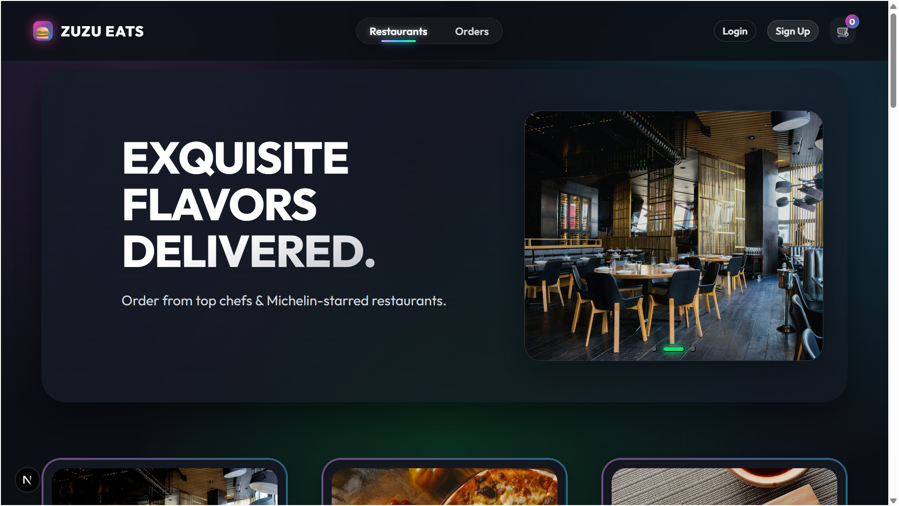

# Online Food Ordering System

It contains a Java Spring Boot backend and a Next.js frontend.

## Project Overview

- **Workspace Name:** `OnlineFoodDeliverySystem`
- **Repository Name:** `FoodDeliveryApplication`
- **Backend Project Folder:** `FoodDeliveryApplicationPro`
- **Frontend Project Folder:** `food-delivery-frontendpro`

## Folder Structure

```text
OnlineFoodDeliverySystem/
|-- FoodDeliveryApplicationPro/     # Spring Boot backend
|-- food-delivery-frontendpro/      # Next.js frontend
|-- README.md
```

## Backend (Spring Boot)

Location: `FoodDeliveryApplicationPro`

### Run Backend

Use your IDE (Eclipse) or run with Maven/Gradle based on your project setup.

Typical behavior:

- Backend starts API services
- Connects to MySQL database
- Exposes REST endpoints for frontend consumption

## Frontend (Next.js)

Location: `food-delivery-frontendpro`

### Install and Run

```bash
cd food-delivery-frontendpro
npm install
npm run dev
```

Open `http://localhost:3000` in the browser.

## Landing Page Screenshot



## Development Notes

- Start backend first, then frontend.
- Ensure frontend API base URL points to backend server.
- Keep environment-specific URLs/configurations separate for local and production.

## Authoring Context

This workspace is actively developed in Eclipse and includes both backend and frontend code for the complete food delivery workflow.
